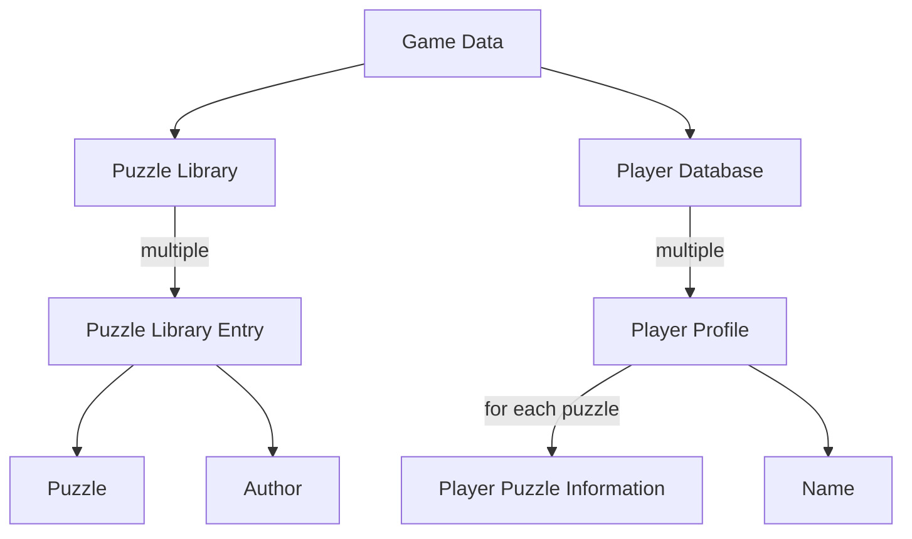
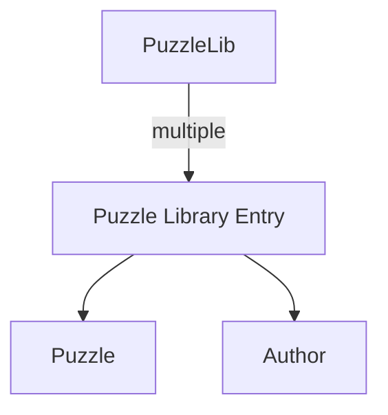
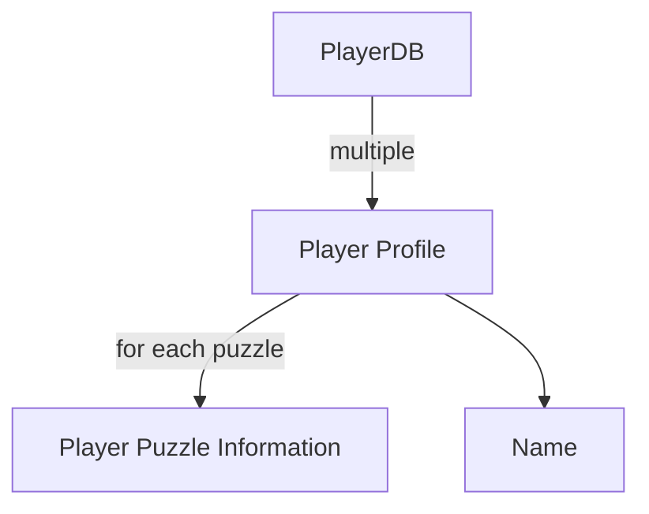
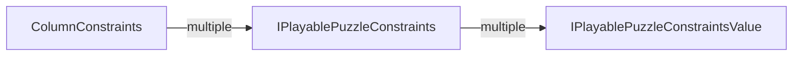

# Design

This text contains diagrams written in Mermaid script. GitHub does not support
this format, but Visual Studio Code does have an extension
"Markdown Preview Mermaid Support."

## PiCrossFacade

The `PiCrossFacade` class is the entry point to the PiCross domain.

```C#
public class PiCrossFacade
{
    public IGameData CreateEmptyGameData();

    public IGameData CreateDummyGameData();

    public IGameData LoadGameData( string path, bool createIfNotExistent = false );

    public IPuzzleEditor CreatePuzzleEditor( Puzzle puzzle );

    public IStepwisePuzzleSolver CreateStepwisePuzzleSolver(
        ISequence<Constraints> rowConstraints,
        ISequence<Constraints> columnConstraints );

    public IPlayablePuzzle CreatePlayablePuzzle( Puzzle puzzle );
}
```

The three first methods (`CreateEmptyGameData()`, `CreateDummyGameData()` and
`LoadGameData()`) allow you to get access to a `IGameData` object.
This object contains all data related to players and puzzles. See below for more information.

`CreateDummyGameData()` is probably the most practical for development/debugging purposes.
However, for a fully functional project, you will need to switch to `LoadGameData`.

`CreatePuzzleEditor` allows you to create a `IPuzzleEditor` object, which
assists you in creating a puzzle editor. You will only need this method
if you wish to implement puzzle editing functionality.

You will probably not need `CreateStepwisePuzzleSolver`.

`CreatePlayablePuzzle` will be indispensible for creating the actual game.
It returns an `IPlayablePuzzle` object which features
all functionality to let players solve a puzzle.

## `IGameData`

All PiCross-related data is stored in an `IGameData` object.
It has the following structure:



The Game Data has two components:

* The Puzzle Library: contains all data concerning puzzles
* The Player Database: stores all player-related information

## Puzzle Library



In code:

```C#
public interface IPuzzleLibrary
{
    IEnumerable<IPuzzleLibraryEntry> Entries { get; }

    IPuzzleLibraryEntry Create( Puzzle puzzle, string author );
}

public interface IPuzzleLibraryEntry
{
    Puzzle Puzzle { get; set; }

    string Author { get; set; }
}
```

As you can see, an `IPuzzleLibrary` object contains
a list of `Entries` of type `IPuzzleLibraryEntry`.
An entry consists of a `Puzzle` object and an `Author`.

## Player Database



In code:

```C#
public interface IPlayerLibrary
{
    IPlayerProfile this[string name] { get; }

    IPlayerProfile CreateNewProfile( string name );

    bool IsValidPlayerName( string name );

    IList<string> PlayerNames { get; }
}

public interface IPlayerProfile
{
    IPlayerPuzzleInformation this[IPuzzleLibraryEntry libraryEntry] { get; }

    string Name { get; }
}

public interface IPlayerPuzzleInformation
{
    TimeSpan? BestTime { get; set; }
}
```

To get a list of all player names, use the `PlayerNames` property.
Once you got hold of a player name, you can use the indexer
to get the player's profile:

```C#
var facade = new PiCrossFacade();
var playerName = facade.PlayerDatabase.PlayerNames[0]; // Get first player's name
var playerProfile = facade.PlayerDatabase[playerName]; // Indexing player database to get profile
```

The `IPlayerProfile` tracks the player's progress. For each puzzle,
you can query the `IPlayerPuzzleInformation`:

```C#
var puzzleEntry = facade.PuzzleLibrary.Entries.First(); // Get first puzzle from library
var info = playerProfile[puzzleEntry];
// info contains player's progress for puzzle
```

## PlayablePuzzle

A `Puzzle` object is immutable: it simply represents the actual puzzle, meaning
you can ask for the solution and the constraints, but not much more.

To make it possible to *solve* a puzzle, we need a mutable object, one
that lets us mark certain squares as empty/filled. This is `IPlayablePuzzle`'s purpose.

Given a `Puzzle`, you can make an `IPlayablePuzzle` through the facade:

```C#
var playablePuzzle = facade.CreatePlayablePuzzle(puzzle);
```

The relevant interfaces are:

```C#
public interface IPlayablePuzzle
{
    IGrid<IPlayablePuzzleSquare> Grid { get; }

    Cell<bool> IsSolved { get; }

    Cell<int> UnknownCount { get; }

    Cell<bool> ContainsUnknowns { get; }

    ISequence<IPlayablePuzzleConstraints> ColumnConstraints { get; }

    ISequence<IPlayablePuzzleConstraints> RowConstraints { get; }
}

public interface IPlayablePuzzleSquare
{
    Cell<Square> Contents { get; }

    Vector2D Position { get; }
}

public interface IPlayablePuzzleConstraints
{
    ISequence<IPlayablePuzzleConstraintsValue> Values { get; }

    Cell<bool> IsSatisfied { get; }
}

public interface IPlayablePuzzleConstraintsValue
{
    int Value { get; }

    Cell<bool> IsSatisfied { get; }
}
```

`IPlayablePuzzle.Grid` models a mutable grid: it allows you to mark squares.
Index `Grid` with a `Vector2D` object to reach the square you want:

```C#
var position = new Vector2D(x, y);
var square = playablePuzzle.Grid[position];

// Mark the square as filled
square.Contents.Value = Square.FILLED;
```

The properties `IsSolved`, `UnknownCount` and `ContainsUnknown`
let you detect how the game progresses. Note that all three are `Cell`s,
making them observable. For example, once the player
has correctly filled in the last remaining square,
`IsSolved` will turn from `false` to `true`. In order
to react to this change (e.g. show a message), you want to know
*when* this change takes place, so you'll want to observe `IsSolved`.

`ColumnConstraints` and `RowConstraints` correspond, unsurprisingly,
to the column and row constraints of the puzzle. Make sure to take
your time to understand their structure:



One `IPlayablePuzzleConstraints` object models the list of numbers
next to one column or row. Each number is modeled by an `IPlayablePuzzleConstraintsValue` object.
For example, consider the puzzle

<center>

```text
        21213

1 1 1   x.x.x
5       xxxxx
1       ....x
```

</center>

* `playablePuzzle.RowConstraints` corresponds to `[ [1, 1, 1], [5], [1] ]`.
* `playablePuzzle.RowConstraints[0]` of type `IPlayablePuzzleConstraints` corresponds to one of `[1, 1, 1]`.
* `playablePuzzle.RowConstraints[0].Values[0]` of type `IPlayablePuzzleConstraintsValue` corresponds to the first `1`.

Constraints can be satisfied on two levels. For example, consider the row constraints `[1, 2]` for
a row 8 squares wide.
At first, all squares are marked unknown, so the constraints are unsatisfied. Say the player
marks the two leftmost cells:

<center>

```text
x.??????
```

</center>

Here, the `1` of `[1, 2]` has been satisfied. This will be reflected by

```C#
rowConstraints.Values[0].IsSatisfied.Value == true
rowConstraints.Values[1].IsSatisfied.Value == false
```

Next, say the player makes the following changes:

<center>

```text
x.??.xx.
```

</center>

Here, both `1` and `2` are satisfied:

```C#
rowConstraints.Values[0].IsSatisfied.Value == true
rowConstraints.Values[1].IsSatisfied.Value == true
```

However, the constraint as a whole is not satisfied yet, this because there are still
unknowns left:

```C#
rowConstraints.IsSatisfied.Value == false
```

Say the player completes the row:


<center>

```text
x....xx.
```

</center>

Now the `rowConstraints` are satisfied as a whole:

```C#
rowConstraints.IsSatisfied.Value == true
```
